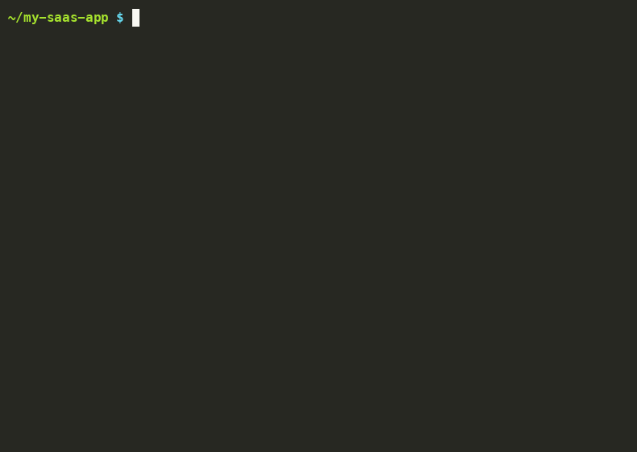

# ai-brain

[](https://www.npmjs.com/package/ai-brain)
[](https://www.npmjs.com/package/ai-brain)
[](https://nodejs.org)
[](LICENSE)
[](https://github.com/ItsWambarYT/ai-brain/stargazers)

> **Give every AI coding agent a persistent, personalized brain — built from your real projects and history. One command.**

**⭐ If this saves you time, star the repo — it helps others find it.**

```bash
npx ai-brain
```

Works with **Claude Code · Gemini CLI · Cursor · Windsurf · GitHub Copilot · Cline · Aider · Continue · Codex CLI**



---

## The Problem

Your AI coding agents start every session with zero memory. They don't know your stack, your conventions, which projects you're working on, or what you did last week. The more agents you use, the worse it gets — each one is a blank slate every time.

---

## What It Generates

### 1. A Personalized Brain Vault (`~/AgentBrain/`)

Not a generic empty template — a vault **built from your actual machine**:

- Scans your git repos (Desktop, Documents, Projects, code, src, dev…) for active projects
- Reads your Claude Code memory files to find past topics
- Detects which AI tools you have installed
- Creates a `Home.md` listing your real projects with detected stacks and last-active dates
- Creates `Me.md` with your inferred role, languages, and frameworks
- Creates skill notes for each framework you actually use (`Skills/NextJS.md`, `Skills/FastAPI.md`…)
- Creates project notes for each detected repo (`Projects/MySaaS.md`…)

**Before ai-brain:**
```
AgentBrain/
  Home.md   ← "Add your projects here"
```

**After ai-brain:**
```
AgentBrain/
  Home.md             ← lists YOUR actual projects with stacks + last active dates
  Me.md               ← YOUR inferred role: "Full-Stack Developer · TypeScript · Python"
  Daily/
    2024-01-15.md     ← "Found 4 projects: my-saas (Next.js), api-server (FastAPI)…"
  Skills/
    NextJS.md         ← Next.js patterns (because you have Next.js projects)
    FastAPI.md        ← FastAPI patterns (because you have FastAPI projects)
    TypeScript.md     ← TypeScript rules
    AIAgents.md       ← your AI tools setup
  Projects/
    my-saas.md        ← stack, path, last active, status
    api-server.md     ← stack, path, last active, status
```

Every session, every agent reads this vault. They know who you are, what you're building, and what you've been doing — automatically.

### 2. Context Files for Every Agent

Generated from the same detected stack — not a generic template:

| File | Agent | Contains |
|------|-------|---------|
| `CLAUDE.md` | Claude Code | Full project context, coding rules, commands |
| `AGENTS.md` | Codex CLI, Aider | Project context + brain vault instructions |
| `.cursorrules` | Cursor IDE | Same as CLAUDE.md |
| `.windsurfrules` | Windsurf IDE | Same as CLAUDE.md |
| `.github/copilot-instructions.md` | GitHub Copilot | Same as CLAUDE.md |
| `.clinerules` | Cline | Same as CLAUDE.md |
| `.aider.conf.yml` | Aider | Points to AGENTS.md |

### 3. Global Agent Wiring

| File | Agent | Effect |
|------|-------|--------|
| `~/.claude/CLAUDE.md` | Claude Code | Reads brain vault on every session |
| `~/.gemini/GEMINI.md` | Gemini CLI | Reads brain vault on every session |
| `~/.continue/config.md` | Continue | Reads brain vault on every session |

---


## Smart Onboarding

When auto-detection finds limited data (new machine, empty home dir), ai-brain runs a 5-question interview instead of giving you a blank vault:

```
? Your name: Alex Chen
? Your role: Full-Stack Developer
? Primary languages: [x] TypeScript  [x] Python
? Frameworks you use: [x] Next.js  [x] FastAPI  [x] Tailwind CSS
? Coding style: Functional, small functions, strict types
? Package manager: pnpm
? What are you currently working on? Building a SaaS with Next.js and Stripe
? One rule every AI agent must follow: Never add comments unless the WHY is non-obvious
```

60 seconds. The answers go directly into `Me.md` and `Workflow.md` — the two notes every agent reads at session start.

## Quick Start

```bash
# Interactive (recommended for first run)
npx ai-brain

# Non-interactive — accept all defaults
npx ai-brain --yes

# Preview without writing anything
npx ai-brain --dry-run
```

### Tell Your AI Agent to Set It Up

Paste this to any AI agent:

> "Run `npx ai-brain --yes` in my project directory"

The `--yes` flag runs everything non-interactively. The agent handles it completely.

Or for a zero-config one-liner:

**macOS / Linux:**
```bash
curl -fsSL https://raw.githubusercontent.com/ItsWambarYT/ai-brain/main/setup.sh | bash
```

**Windows PowerShell:**
```powershell
irm https://raw.githubusercontent.com/ItsWambarYT/ai-brain/main/setup.ps1 | iex
```

---

## Commands

```bash
# Full setup: profile scan + CLAUDE.md + brain vault + all agent configs
npx ai-brain

# Non-interactive (for AI agents to run)
npx ai-brain --yes

# Preview everything without writing
npx ai-brain --dry-run

# Skip brain vault
npx ai-brain --no-brain

# Custom brain vault location
npx ai-brain --brain ~/Documents/MyBrain

# Force overwrite existing CLAUDE.md
npx ai-brain --force

# Generate only CLAUDE.md
npx ai-brain generate

# Force a specific template
npx ai-brain generate --template python-fastapi

# See what's detected in your project
npx ai-brain scan

# Create / update brain vault only
npx ai-brain brain

# Rescan repos and refresh vault with new projects
npx ai-brain update
```

---

## Supported Project Types

Auto-detected. No config needed.

| Type | Detected by | Template |
|------|-------------|---------|
| Next.js | `next` in package.json | Full App Router patterns + RSC rules |
| React + Vite | `react` + `vite` | Component patterns + React Query + Zustand |
| Python FastAPI | `fastapi` in requirements | Route/service/store architecture + async rules |
| Python Data / ML | `pandas`, `torch`, `sklearn`… | Notebook conventions + reproducibility rules |
| Node.js CLI | `bin` in package.json | Unix CLI conventions + exit codes + testing |
| TypeScript Library | `tsconfig.json`, no framework | Dual CJS/ESM build + API design rules |
| Go | `go.mod` | Error wrapping + context propagation + testing |
| Anything else | fallback | Universal coding standards |

Sub-dependencies also detected: tRPC, Prisma, Drizzle, NextAuth, SQLAlchemy, Alembic, Celery, Zustand, Tailwind, and more.

---

## The Brain Protocol

The vault uses a dead-simple convention any agent can follow:

```
Every session start:
  1. Read ~/AgentBrain/Daily/YYYY-MM-DD.md (create if missing)
  2. Read ~/AgentBrain/Home.md

After every meaningful exchange:
  - Append summary to daily note under ### Session N
  - New topic → create ~/AgentBrain/TopicName.md
  - Add [[TopicName]] wikilink to daily note
  - Keep Home.md updated
```

After a few weeks your vault is a knowledge graph of every decision, every fix, every project — readable by any agent in any session.

---

## Privacy & Data Handling

ai-brain runs **entirely on your machine**. No code, file contents, or
configuration is ever sent over the network. There is no analytics, no
telemetry, no cloud component — the tool simply reads from disk and writes
to disk. You can read every line of `src/profiler.js` and `src/scanner.js`
to verify this for yourself.

### What it reads

- **Repo paths only** — directory names under `~/Desktop`, `~/Documents`,
  `~/Projects`, `~/code`, `~/src`, `~/dev` etc. No source code is opened.
- **Manifest files** — `package.json`, `pyproject.toml`, `requirements.txt`,
  `setup.py`, `go.mod`, `Cargo.toml`, `Gemfile`, `composer.json`, `Dockerfile`.
  Only dependency lists + project name are extracted. Lock files, scripts,
  and arbitrary fields are ignored.
- **Last-commit timestamp** of each repo (via `git log -1 --format=%cI`),
  to surface recently-active projects in the generated `Home.md`.
- **AI agent config existence** — which tools you have installed (Claude Code,
  Gemini CLI, Cursor, etc.). Tool *contents* are not read, only the file's
  presence.
- **Claude Code memory index** (`~/.claude/projects/.../memory/MEMORY.md` or
  the `~/.claude/CLAUDE.md` file). These are short summaries *you* wrote;
  raw conversation transcripts are never opened.

### What it never reads

- ❌ Source code files (`.js`, `.py`, `.go`, `.rs`, `.ts`, etc.)
- ❌ `.env` / `.env.*` files
- ❌ Anything inside `.git/` (objects, refs, hooks)
- ❌ `node_modules/`, `venv/`, `.venv/`, `__pycache__/`, `dist/`, `build/`
- ❌ Raw AI conversation logs / chat histories
- ❌ Browser data, SSH keys, shell history, system credentials

### What it writes

- `~/AgentBrain/` — the generated brain vault (markdown notes you edit).
  Path is configurable via `--brain-path`; nothing is written outside it.
- `CLAUDE.md`, `AGENTS.md`, `.cursorrules`, `.windsurfrules`,
  `.continue/config.json`, `GEMINI.md`, etc. in the **current project
  directory only** — and only the ones you opt in to during the interactive
  setup. With `--no-brain` or `--dry-run` nothing is written.
- A one-line entry into `~/.claude/CLAUDE.md` (or your global
  `~/.gemini/GEMINI.md`) that points agents at the brain vault. This is
  appended, never overwritten — and only if the matching agent is detected.

### Removing everything

```bash
rm -rf ~/AgentBrain                    # the vault
rm  CLAUDE.md AGENTS.md .cursorrules   # per-project configs you don't want
# (the global CLAUDE.md / GEMINI.md entries are clearly fenced —
#  remove the `<!-- ai-brain -->` block by hand if you no longer want them)
```

---

## Requirements

- **Node.js 18+** — `node --version`, install at [nodejs.org](https://nodejs.org)
- **Obsidian** (optional) — free at [obsidian.md](https://obsidian.md), for the visual knowledge graph

Works on macOS, Linux, and Windows.

---

## Contributing

PRs welcome — see [CONTRIBUTING.md](CONTRIBUTING.md).

**Add a project template:**
1. `src/templates/myframework.md` with `{{PROJECT_NAME}}`, `{{PACKAGE_MANAGER}}`, `{{EXTRA_STACK}}`
2. Detection in `src/scanner.js`
3. Example in `examples/myframework/CLAUDE.md`
4. Docs in `docs/templates.md`

**Add a new AI agent:**
1. Generator function in `src/wirer.js`
2. Call in `src/setup.js`
3. Doc entry in `docs/agents.md`

---

## License

MIT

---

<div align="center">

**Found ai-brain useful?**<br>
[⭐ Star it on GitHub](https://github.com/ItsWambarYT/ai-brain) · [🐛 Report a bug](https://github.com/ItsWambarYT/ai-brain/issues/new?template=bug_report.md) · [💡 Request a feature](https://github.com/ItsWambarYT/ai-brain/issues/new?template=feature_request.md)

</div>
